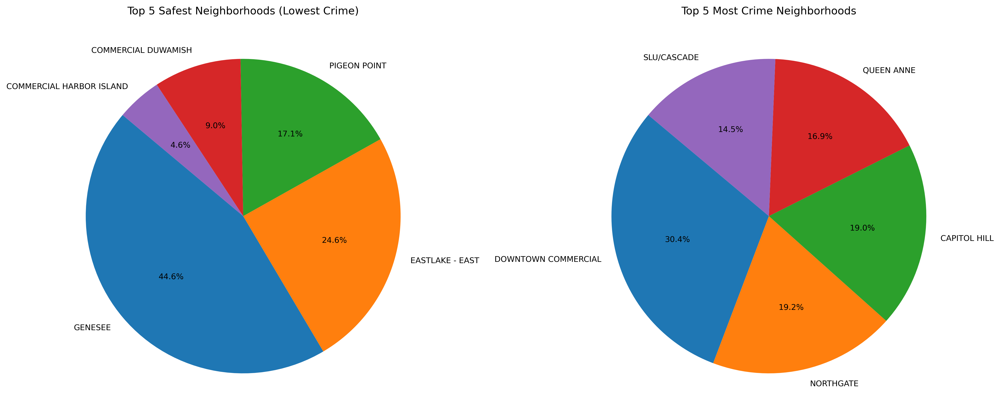
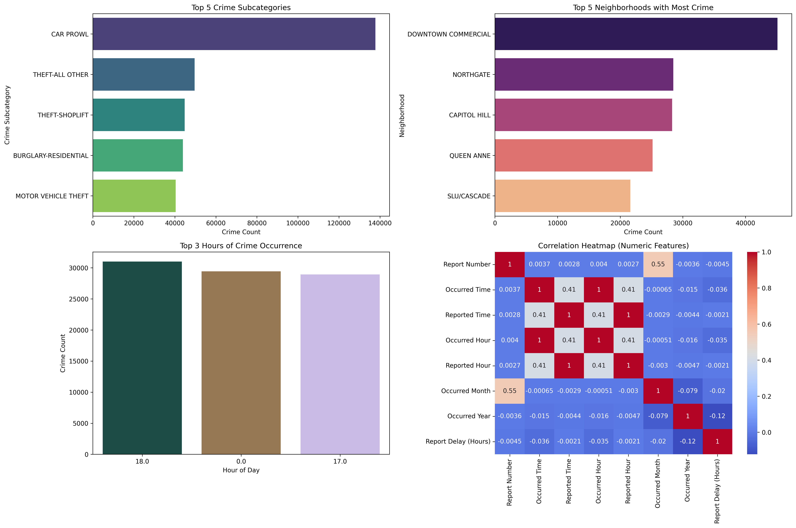

# 📊 Applied Analytics — Seattle Crime Data EDA

[](https://justicetefera.github.io/pro-analytics-02/workflow-b-apply-example-project/)
[](./pyproject.toml)
[](./LICENSE)

> Professional Python project: applied data analytics.

### Repository: `datafun-06-applied`

This project demonstrates a complete, repeatable Exploratory Data Analysis (EDA) workflow applied to a large real‑world dataset: Seattle Police Department crime reports spanning roughly ten years.

The notebook in this repository follows a structured, instructor‑aligned workflow including data loading, cleaning, feature engineering, descriptive statistics, and visual exploration.
For data suggestions, please see [data/raw/README.md](data/raw/README.md).

## 📦 Dataset Description
The dataset contains ~481,000 police‑reported crime incidents from the City of Seattle.
Source: Kaggle — Crime Dataset Analysis by theyazilimci

## Examples

The project includes an additional EDA on a real-world dataset.
Between this and the Module 4 example,
you should be able to see what parts are similar
(the general outline and workflow) and what changes with data.
The two projects together help create an appreciation
for the value of **reusable functions**.

## Working Files

You'll work with these areas:

- **data/raw** - raw data for exploration
- **docs/** - project narrative and documentation
- **src/** - supporting Python package modules
- **notebooks/** - interactive analysis
- **pyproject.toml** - update authorship & links
- **zensical.toml** - update authorship & links


## Success


```shell
========================
Executed successfully!
========================
```

A new file `project.log` will appear in the root project folder.

## 🚀 How to Run the Notebook

<details>
<summary>Show command reference</summary>

### In a machine terminal (open in your `Repos` folder)

After you get a copy of this repo in your own GitHub account,
open a machine terminal in your `Repos` folder:

### Clone the repo

```shell
# Replace username with YOUR GitHub username.
git clone https://github.com/justicetefera/datafun-06-applied

cd datafun-06-applied
code .
```

### Create a virtual environment

```shell
uv self update
uv python pin 3.14
uv lock --upgrade
uv sync --extra dev --extra docs --upgrade

uvx pre-commit install

git add -A
uvx pre-commit run --all-files
# repeat if changes were made
uvx pre-commit run --all-files

# run the example module and verify the environment (.venv/)
uv run python -m datafun.app_case

# do chores
uv run python -m pyright
uv run python -m pytest
uv run python -m zensical build

# save progress
git add -A
git commit -m "update"
git push -u origin main
```

```shell
python -m venv .venv
source .venv/bin/activate   # Windows: .venv\Scripts\activate
```
### Install dependencies
``` shell
pip install -r requirements.txt

pip install pandas numpy matplotlib seaborn ## Manually

```
### Ensure dataset is in place

`data/raw/Crime_Data.csv`

### Launch Jupyter
``` shell
jupyter notebook

notebooks/crime_eda.ipynb

```


</details>


## Output

```shell
 2026-06-19 09:59:46 | INFO | JT-NB | ---------Visualize Correlation Matrix as a Heatmap---------------
2026-06-19 09:59:47 | INFO | JT-NB | Creating scatter plot with legend positioned beside the chart
2026-06-19 10:00:09 | INFO | JT-NB | Creating horizontal boxplot for all crime subcategories
2026-06-19 10:00:09 | INFO | JT-NB | Total categories: 30
2026-06-19 10:00:12 | INFO | JT-NB | Creating vertical bar chart for top 3 occurred hours
2026-06-19 10:00:12 | INFO | JT-NB | Top 3 hours: [18.0, 0.0, 17.0]
2026-06-19 10:00:12 | INFO | JT-NB | Creating side-by-side pie charts for safest and most crime neighborhoods
2026-06-19 10:00:13 | INFO | JT-NB | Creating Executive Summary Dashboard
2026-06-19 10:00:15 | INFO | JT-NB | ======================
2026-06-19 10:00:15 | INFO | JT-NB | SUMMARY
2026-06-19 10:00:15 | INFO | JT-NB | ======================
2026-06-19 10:00:15 | INFO | JT-NB | Dataset: Crime_Data.csv
2026-06-19 10:00:15 | INFO | JT-NB | Original rows: 481376
2026-06-19 10:00:15 | INFO | JT-NB | Clean rows:    481112
2026-06-19 10:00:15 | INFO | JT-NB | Crime Subcategories Found (30): ['AGGRAVATED ASSAULT', 'AGGRAVATED ASSAULT-DV', 'ARSON', 'BURGLARY-COMMERCIAL', 'BURGLARY-COMMERCIAL-SECURE PARKING', 'BURGLARY-RESIDENTIAL', 'BURGLARY-RESIDENTIAL-SECURE PARKING', 'CAR PROWL', 'DISORDERLY CONDUCT', 'DUI', 'FAMILY OFFENSE-NONVIOLENT', 'GAMBLE', 'HOMICIDE', 'LIQUOR LAW VIOLATION', 'LOITERING', 'MOTOR VEHICLE THEFT', 'NARCOTIC', 'PORNOGRAPHY', 'PROSTITUTION', 'RAPE', 'ROBBERY-COMMERCIAL', 'ROBBERY-RESIDENTIAL', 'ROBBERY-STREET', 'SEX OFFENSE-OTHER', 'THEFT-ALL OTHER', 'THEFT-BICYCLE', 'THEFT-BUILDING', 'THEFT-SHOPLIFT', 'TRESPASS', 'WEAPON']
2026-06-19 10:00:15 | INFO | JT-NB | Top 5 Crime Subcategories:
Crime Subcategory
CAR PROWL               137766
THEFT-ALL OTHER          49624
THEFT-SHOPLIFT           44767
BURGLARY-RESIDENTIAL     43908
MOTOR VEHICLE THEFT      40362
Name: count, dtype: int64
2026-06-19 10:00:15 | INFO | JT-NB | Top 3 Hours of Crime Occurrence:
Occurred Hour
18.0    31005
0.0     29432
17.0    28925
Name: count, dtype: int64
2026-06-19 10:00:16 | INFO | JT-NB | Top 5 Neighborhoods with Most Crime:
Neighborhood
DOWNTOWN COMMERCIAL    45114
NORTHGATE              28468
CAPITOL HILL           28286
QUEEN ANNE             25155
SLU/CASCADE            21618
Name: count, dtype: int64
2026-06-19 10:00:16 | INFO | JT-NB | ======================
2026-06-19 10:00:16 | INFO | JT-NB | Review the results:
2026-06-19 10:00:16 | INFO | JT-NB | - Examine top crime categories
2026-06-19 10:00:16 | INFO | JT-NB | - Identify peak crime hours
2026-06-19 10:00:16 | INFO | JT-NB | - Compare neighborhoods with highest activity
2026-06-19 10:00:16 | INFO | JT-NB | - Review correlations and scatterplots
2026-06-19 10:00:16 | INFO | JT-NB | - Look for patterns in reporting delays
2026-06-19 10:00:16 | INFO | JT-NB | ======================
2026-06-19 10:00:16 | INFO | JT-NB | Next Steps:
2026-06-19 10:00:16 | INFO | JT-NB | - Document insights in README.md
2026-06-19 10:00:16 | INFO | JT-NB | - Write narrative in docs/index.md
2026-06-19 10:00:16 | INFO | JT-NB | - Add charts and interpretations
2026-06-19 10:00:16 | INFO | JT-NB | - Suggest modeling or deeper analysis directions
2026-06-19 10:00:16 | INFO | JT-NB | ======================
2026-06-19 10:00:16 | INFO | JT-NB | EDA workflow complete
2026-06-19 10:00:16 | INFO | JT-NB | ==============================
2026-06-19 10:00:16 | INFO | JT-NB | === Executed successfully! ===
2026-06-19 10:00:16 | INFO | JT-NB | ==============================
```

## Findings and Visuals
## 📊 Side‑by‑Side Pie Charts — Safest vs. Most Crime Neighborhoods



These pie charts compare Seattle neighborhoods with the lowest and highest crime counts.

On the left, the Top 5 Safest Neighborhoods show that Genesee accounts for nearly half of all low‑crime incidents (48.6%), followed by Eastlake East (24.8%) and Pigeon Point (17.1%). Smaller segments like Commercial Harbor Island and Commercial Duwamish represent minimal crime activity, indicating relatively secure areas.

On the right, the Top 5 Most Crime Neighborhoods reveal that Downtown Commercial leads with 33.4% of incidents, followed by Northgate (19.2%), Capitol Hill (18.9%), Queen Anne (13.9%), and South Cascade (14.6%). These areas show concentrated crime activity, likely influenced by higher population density, nightlife, and commercial zones.

Together, these charts highlight Seattle’s contrasting neighborhood profiles—some consistently safe and others persistently high in crime—offering valuable insight for targeted community safety initiatives and resource allocation.


## 📊 Executive Summary Dashboard



This 4‑panel dashboard provides a high‑level overview of Seattle crime patterns:

**Top 5 Crime Subcategories**
A small number of crime types dominate the dataset, with Car Prowl, Theft categories, and Residential Burglary appearing most frequently.

**Top 5 Neighborhoods with Most Crime**
Downtown Commercial leads all neighborhoods in crime volume, followed by Northgate, Capitol Hill, Queen Anne, and South Cascade—areas associated with dense population, nightlife, and commercial activity.

**Top 3 Hours of Crime Occurrence**
Crime peaks at predictable times: midnight, late afternoon, and early evening. These patterns align with nightlife activity and commuter flow.

**Correlation Heatmap**
Numeric features show weak correlations overall. Occurred Hour and Reported Hour have a modest positive relationship, while reporting delays show little connection to time‑based features.

Together, these panels provide a concise, executive‑level snapshot of Seattle’s crime landscape.


- your figures and narrative should reflect your work,
- this `README.md` should include your commands, process, and visuals, and
- `docs/index.md` should include your narrative.

## Project Documentation

Additional instructions, terms, and project notes:

[docs/index.md](docs/index.md)

## Citation

[CITATION.cff](./CITATION.cff)

## License

[MIT](./LICENSE)
